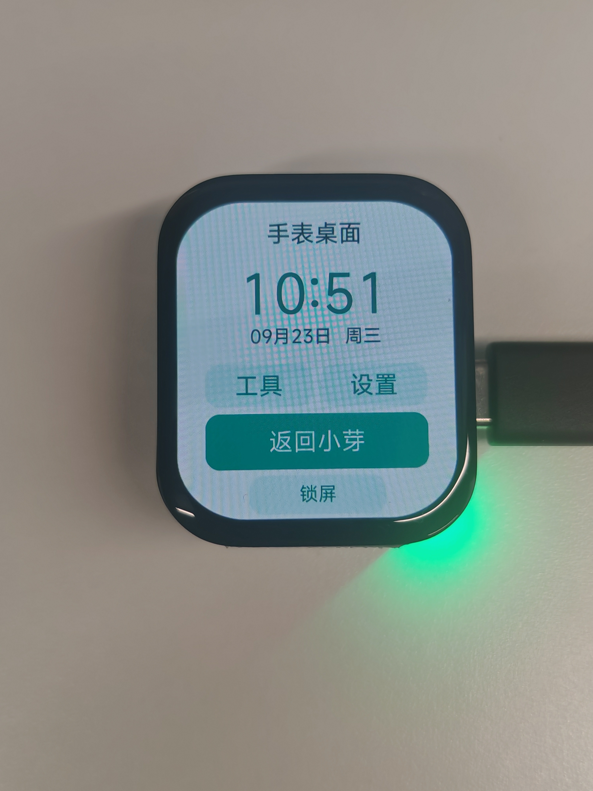
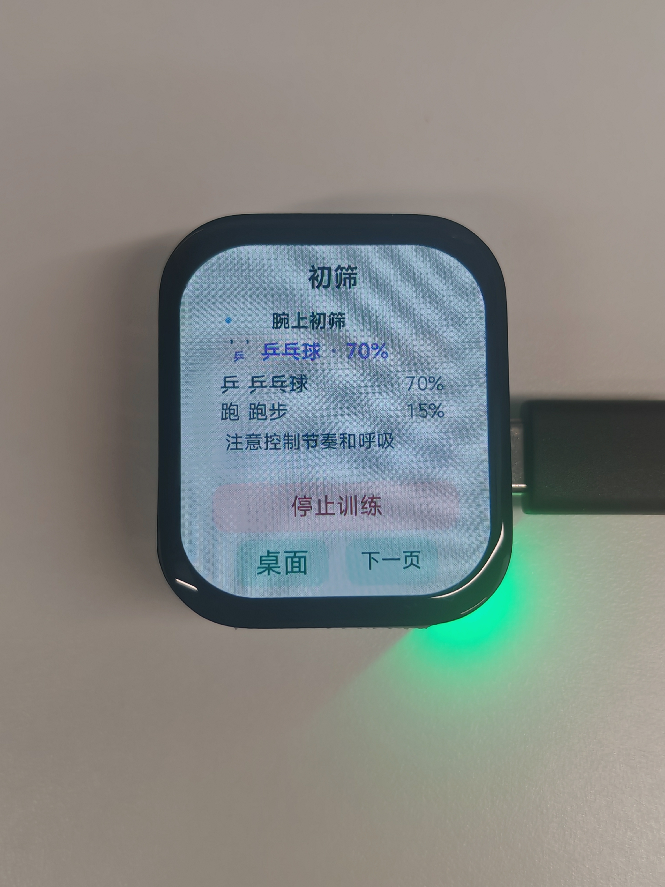
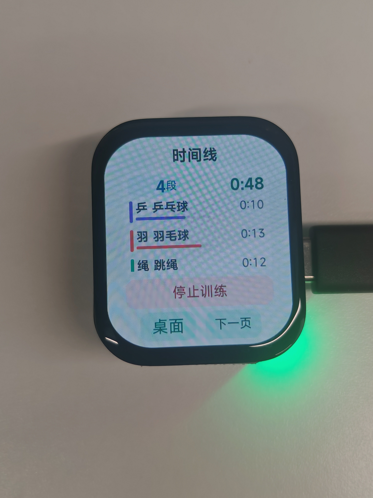
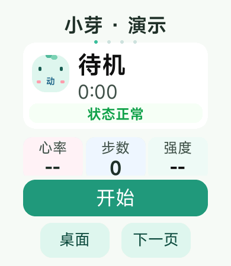
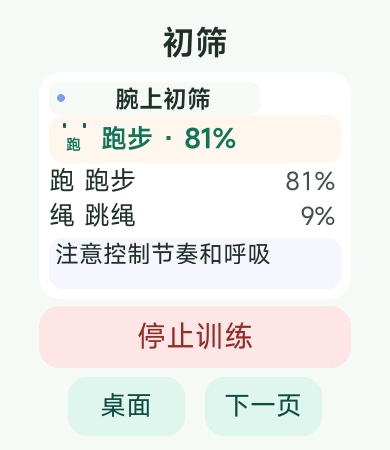
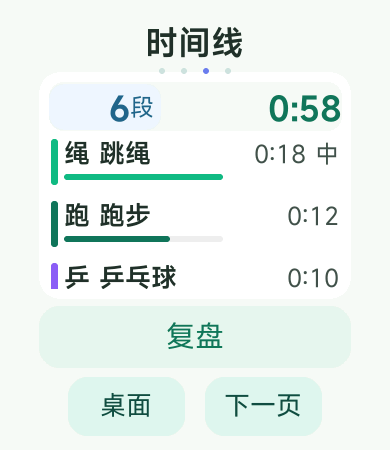

# 腕动教练 · VelaMotion Coach

**让混合训练有清楚的记录。**

2026 首届 openvela AI 硬件开发者大赛 · 手表应用创新方向

队伍 **DDLqudong（289）** · 孔明昊：方案与代码 · 刘子荣：调试

腕动教练以“小芽”运动伙伴组织开始、查看、停止与复盘，在立创·黄山派 SF32LB52 上集成 openvela/NuttX、原生手表桌面和 QuickApp。面向跑步、跳绳等交替进行的混合训练，用活动初筛与时间线展示各阶段的状态和持续时间。

**[在线体验 · WebAssembly 演示](https://rudykon.github.io/contest2026_289_DDLqudong/)** · **[下载黄山派固件](https://github.com/rudykon/contest2026_289_DDLqudong/releases/tag/huangshan-20260923)** · **[部署与构建指南](board/huangshan_openvela/README.md)** · **[应用源码](quickapp/velamotion_coach/src)**

## 浏览器在线演示

**[打开作品展示页](https://rudykon.github.io/contest2026_289_DDLqudong/)**，选择混合训练或单项活动，即可查看六轴波形、六类候选评分、训练片段和当前浏览器的计算耗时。支持暂停、4× 快览和本地导出结果。

特征提取与活动评分真正运行于 **WebAssembly**，后台 Worker 保持界面响应，时序整理复用项目 JS 实现。使用项目合成运动数据，不读取真实传感器；浏览器跑分不代表黄山派性能。网站源码、移植说明与验证方式见 [website/README.md](website/README.md)。

## 实物展示

<table>
  <tr>
    <td align="center"><br>手表桌面</td>
    <td align="center"><br>活动初筛</td>
    <td align="center"><br>训练时间线</td>
  </tr>
</table>

以上为 2026-09-24 现有实拍，训练画面使用应用内演示数据。照片展示物理屏幕上的页面，不单独证明固件版本、真实六轴采集或手指触控验收。公开图片已移除定位等照片元数据，显示内容保持原样。

## 可以做什么

| 功能 | 实现内容 |
| --- | --- |
| 原生桌面 | 时钟、工具、设置、小芽入口，以及长按解锁的防误触锁屏。 |
| 实用工具 | 秒表、倒计时、系统信息；离开工具页后继续计时，到时显示屏幕提醒。 |
| 训练交互 | 大字与圆角屏留白；左右切换四页、上下滚动，拖动时取消按钮动作。 |
| 活动初筛 | 为无活动、羽毛球、跳绳、飞鸟、跑步、乒乓球六类计算候选评分。 |
| 分段回顾 | 平滑与时序解码整理活动片段；停止后查看摘要、时间线与复盘建议。 |
| 桌面与应用切换 | 返回桌面保留应用实例，再从“返回小芽”恢复页面和训练状态。 |

操作流程：**桌面打开小芽 → 开始演示训练 → 左右滑动查看教练与时间线 → 停止并等待整理 → 查看复盘**。

### 板端界面

<table>
  <tr>
    <td align="center"><br>当前固件 · 待机首页</td>
    <td align="center"><br>前序稳定版 · 候选评分</td>
    <td align="center"><br>前序稳定版 · 分段结果</td>
  </tr>
</table>

这组 PNG 是串口取回的板端 LVGL 渲染截图。分类与非空时间线来自前序稳定版的 Mock 会话，三张图并非同一连续操作；候选百分比不是人体识别准确率。

## AI 能力与工程实现

当前采用可解释的 JS 特征规则分类器。按设计的 16 Hz、3 秒窗口组织 48 帧六通道输入，提取统计与周期特征，再通过平滑和 Viterbi 时序解码形成活动片段。当前板端演示使用 Mock 数据，研究阶段的深度模型尚未部署到此固件。

实板工程主要完成了以下工作：

- **运行栈接入**：openvela/NuttX、LVGL 9 与 QuickApp 集成，处理本地服务、JS 堆、应用资源及可写目录。
- **交互调度**：按需创建页面并保留缓存，减少隐藏页更新；停止整理分成六个事件循环阶段，保护忙状态和异步保存回调。
- **图形与资源**：适用场景下使用有界 EPIC 填充、复制和掩码混合，失败时软件回退；精简两套中文字库并保留现有字重。

新增 GPU 绘制覆盖不等于所有操作都会更快。实现范围及已知限制见[板端指南](board/huangshan_openvela/README.md)。

## 固件下载与烧录

当前提供 **黄山派开发验证版 `huangshan-20260923`**，固件源码基线为 [`03f3543`](https://github.com/rudykon/contest2026_289_DDLqudong/commit/03f3543922d8ce4b6cb32fd1270fc8851fa668ba)。

- [Release 页面与下载](https://github.com/rudykon/contest2026_289_DDLqudong/releases/tag/huangshan-20260923)
- [完整固件 `velamotion-openvela.bin`](https://github.com/rudykon/contest2026_289_DDLqudong/releases/download/huangshan-20260923/velamotion-openvela.bin)
- [SHA256 校验文件](https://github.com/rudykon/contest2026_289_DDLqudong/releases/download/huangshan-20260923/SHA256SUMS.txt)

固件大小 **5,871,668 B**，烧录地址 **`0x12010000`**，适用 SF32LB52 / 390×450 显示配置。它包含系统、桌面、QuickApp 运行时与应用资源；应用 manifest 版本为 1.0.0，使用公开开发测试证书签名。

下载后核对 SHA256，将镜像放到 `board/huangshan_openvela/firmware/velamotion-openvela.bin`。准备 `sftool.exe`，关闭占用串口的工具，然后在 `board/huangshan_openvela` 中运行：

```powershell
.\flash-quickapp.ps1 -PortName COM5 -SfTool 'C:\tools\sftool.exe'
```

将串口和工具路径改为实际值。脚本核对大小与哈希，写入镜像、校验、复位并同步时间。烧录会替换当前镜像，有需保留的系统时先备份。完整环境、重编译和回退说明见[部署指南](board/huangshan_openvela/README.md)；原构建脚本含 Windows/WSL 路径，换机需要配置。

## 验证结果与当前边界

2026-09-24 在固定源码上重跑主机回归：核心模块 **54 项**、手势 **7 项**、合成运动 **53 个断言**，以及实时字段、协作停止和原生桌面逻辑测试均通过。软件回归验证状态和逻辑，不等于真实硬件或人体效果验收。

同一固件、新增掩码路径开启的一轮合成操作记录中，缓存切页中位数 **454 ms（n=4）**，停止反馈 **547 ms（n=1）**；停止函数入口至保存 API 回调为 **857 ms（n=1）**。界面反馈从合成按下计时，包含约 100 ms 按压；保存起点不同，均不包含真实触摸采样和物理面板响应。对照没有证明新增 GPU 路径普遍提速。

| 能力 | 当前状态 |
| --- | --- |
| 真实六轴 → QuickApp JS | 原生器件曾可读，当前页面尚未接通完整真实六轴；能力不全时真实训练拒绝启动。 |
| 历史持久化 | `/data` 为 RAM 文件系统；本次开机内可读写，复位或断电即丢失。 |
| 真实健康数据与互联 | 心率等真实传感、振动及手机互联未完成板端支持；演示数据有明确标识。 |
| 桌面工具 | 倒计时仅屏幕提醒；锁屏用于防误触，非密码锁或休眠。亮度、时间与计时状态复位后需重设。 |
| 产品效果 | 真人识别准确率、整机功耗、长期稳定性与本固件手指触控尚需验证。 |

## 开发入口

Node.js 22 为已使用的开发环境；快应用项目支持以下命令：

```bash
cd quickapp/velamotion_coach
npm ci
npm run test:core
npm run test:gesture
npm run test:motion
npm run test:ui-performance
```

| 路径 | 用途 |
| --- | --- |
| [`quickapp/velamotion_coach/src`](quickapp/velamotion_coach/src) | 训练业务、页面、活动初筛与时序处理。 |
| [`board/huangshan_openvela`](board/huangshan_openvela) | 原生桌面、运行栈适配、构建和烧录。 |
| [`quickapp/velamotion_coach/README.md`](quickapp/velamotion_coach/README.md) | 应用开发与模拟器运行说明，部分材料属于前序阶段。 |
| [`skills/openvela-watch-acceptance`](skills/openvela-watch-acceptance) | 版本、输入来源与交互验收的可复用流程。 |
| [`docs/official_repository_guide.md`](docs/official_repository_guide.md) | 官方工程与清单使用说明。 |

源码遵循 [Apache-2.0](LICENSE)，第三方组件保留各自许可证。作者签名私钥不分发；历史 AI 开发对话、调用轨迹及其摘要不公开。
